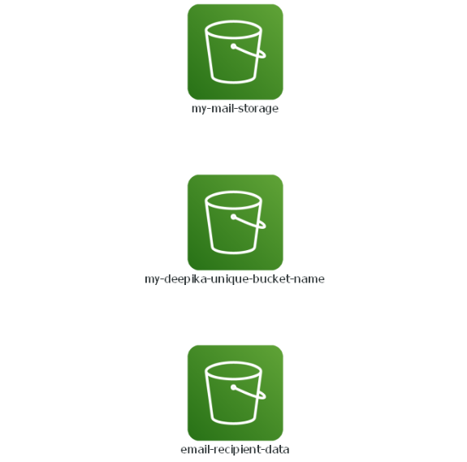
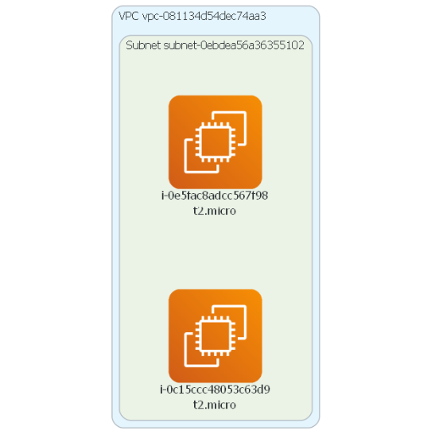
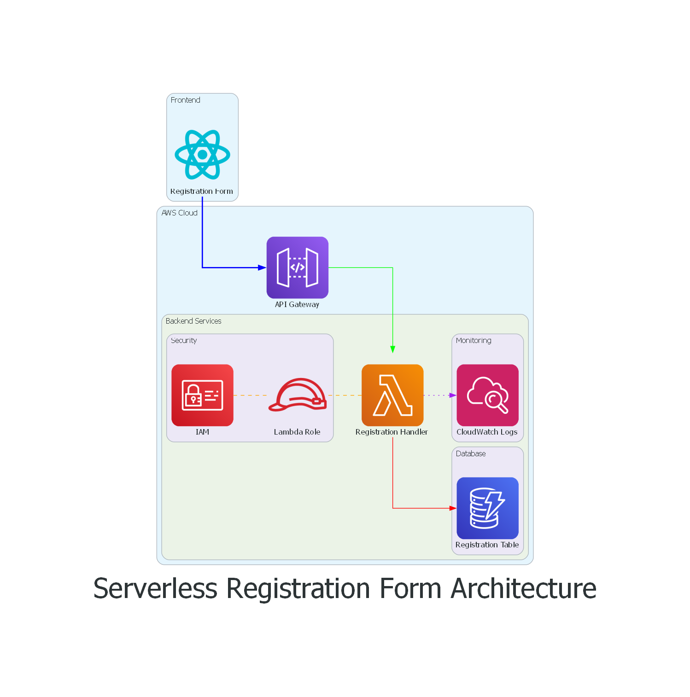

# 🚀 AWS Infrastructure Documentation Generator

**Automate Your Cloud Clarity: Scan, Visualize, Document, Track, and Secure Your AWS Infrastructure**

Managing AWS infrastructure manually can be overwhelming, especially when scalability, compliance, and documentation are at stake. The **AWS Infrastructure Documentation Generator** is your all-in-one solution to auto-discover, visualize, document, and track your AWS resources — bringing clarity to your cloud.

---

## 🔧 Features

- **🔍 Real-time Infrastructure Scanning**  
  Automatically scans your AWS account for all active resources.

- **🖼 Dynamic Architecture Diagrams**  
  Visualize your AWS environment with automatically generated diagrams (SVG, PNG, PDF).

- **📄 Human-Readable Documentation**  
  Converts raw infrastructure into clean, easy-to-read Markdown or HTML docs.

- **📊 Automated Compliance Reports**  
  Enforce policies and flag misconfigurations with compliance config files.

- **📈 Infrastructure Change Tracking**  
  Track what's changed, when, and why — for audits or team awareness.

---

## 🎯 Why Use This Tool?

| Benefit | Description |
|--------|-------------|
| 🔍 **Real-Time Visibility** | Instantly discover and view all your AWS resources |
| ✍️ **Zero Manual Effort** | No more hand-drawn diagrams or manually written documentation |
| 👥 **Team Collaboration** | Share architecture and reports across dev, ops, and security teams |
| 🔐 **Security & Compliance** | Enforce best practices and prepare for audits |
| 📆 **Change Tracking** | Keep a historical log of infrastructure modifications |

---

## 💰 Cost Optimization Benefits

- 🚫 **Find Unused Resources:** Identifies idle EC2s, stale snapshots, and unattached EBS volumes  
- 🧠 **Right-Sizing Suggestions:** Based on utilization data  
- 🧹 **Auto Cleanup:** Helps identify orphaned or zombie resources  
- 💵 **Track Cost-related Changes:** Correlates infra changes to cost spikes  
- ✅ **Enforce Cost-Saving Rules:** S3 lifecycle, encryption policies, etc.

## 🧠 System Design — AWS InfraDoc Generator

<table align="center">
  <tr>
    <td align="center">
      <br>
      <b>AWS Infrastructure Documentation Generator</b>
    </td>
    </tr>
</table>
### 1️⃣ Scanning AWS Infrastructure in Real Time

The tool leverages AWS SDKs like **Boto3** or the **AWS CLI** to connect to your AWS account and automatically discover resources such as:

- EC2 Instances
- S3 Buckets
- RDS Databases
- Lambda Functions
- VPCs, IAM Roles, and more

It fetches metadata including:
- Configuration (instance types, encryption, policies)
- Tags (owner, environment, purpose)
- Relationships (e.g., Lambda triggered by API Gateway)
- Current state and usage

✅ This enables teams to maintain complete visibility of their AWS environment — no more manual mapping or outdated Excel sheets!

<table align="center">
  <tr>
    <td align="center">
      <br>
      <b>Some of s3 buckets listed in my account</b>
    </td>
    <td align="center">
      <br>
      <b>Some of EC2 instances listed in my accout</b>
    </td>
  </tr>
</table>


### 2️⃣ Generating Dynamic Architecture Diagrams

Using **Diagrams (Python)**, **PlantUML**, or **Graphviz**, the tool translates raw metadata into visual representations:

- Automatically generated from live infrastructure data
- Updated on each scan or change
- Exported as **PNG**, **SVG**, or embedded **Markdown**

📊 These diagrams offer clarity for developers, architects, and ops teams alike.
<table align="center">
  <tr>
    <td align="center">
      <br>
      <b>Swasthyashe Web App</b>
    </td>
    <td align="center">
      <br>
      <b>Serverless Registration Web App</b>
    </td>
  </tr>
</table>


### 3️⃣ Producing Human-Readable Documentation

Transforms AWS resource metadata into structured docs:

- Includes configuration, regions, IAM policies, networking, security
- Output in **HTML**, **Markdown**, or **PDF**
- Easy to integrate with **Notion**, **Confluence**, or GitHub Wiki

## 📄 Sample Documentation

A sample PDF version of the generated documentation is available for reference:  
👉 [View Sample Documentation](https://drive.google.com/file/d/1agkY-mAMvi30qpUjcuElTp-KyJZ5FNsC/view?usp=sharing)


### 4️⃣ Tracking Infrastructure Changes

Supports change detection and auditing via snapshots:

- Stores historical states in **S3 (with versioning)**
- Detects additions, deletions, and modifications
- Maintains changelogs for rollback and compliance
- (Optional) Alerting on unauthorized changes


### 5️⃣ Generating Automated Compliance Reports

Validates your infrastructure using:
- YAML-based rule definitions
- AWS Config Rules or Security Hub integrations

Checks for:
- Encryption enforcement (EBS, S3, RDS)
- Public access blocking (S3, EC2)
- IAM over-permissiveness
- Approved instance types or regions

📄 Compliance reports available in **PDF**, **JSON**, and **HTML** formats for easy auditing.

## 📝 Blog  
Check out the detailed blog post on Medium:  
👉 [Automate Your Cloud Clarity: AWS Infrastructure Documentation Generator](https://medium.com/@siddadeepika/automate-your-cloud-clarity-aws-infrastructure-documentation-generator-e057c196c410)


## ✅ Getting Started: Prerequisites

Make sure you have:

- Python 3.8+ installed
- AWS CLI configured (`aws configure`)
- Proper IAM permissions granted for EC2, S3, RDS, Lambda, IAM, etc.


## 📦 Installation Guide

```bash
git clone https://github.com/DeepikaSidda/AWS-Infrastructure-Documentation-Generator.git
cd AWS-Infrastructure-Documentation-Generator
pip install -r requirements.txt


